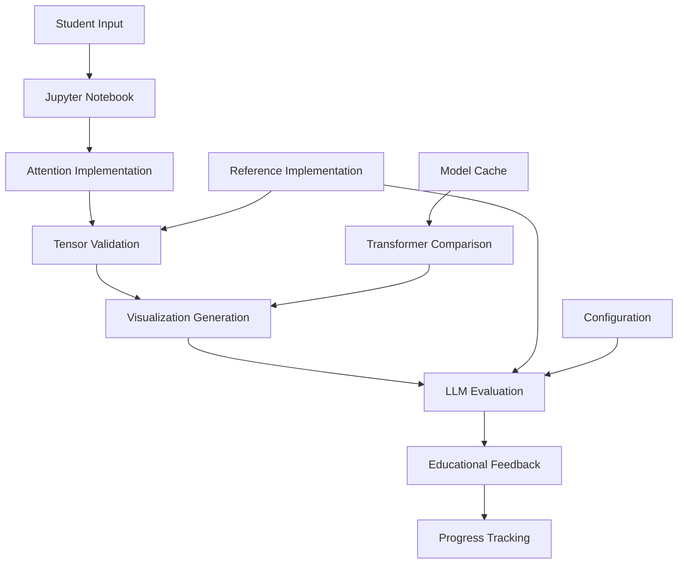

# Technical Specifications

## Overview

This document provides comprehensive technical specifications for the Attention Mechanism Educational Project, including system requirements, architecture details, performance characteristics, and scalability considerations.

## System Requirements

### Minimum Hardware Requirements

| Component | Minimum | Recommended | Notes |
|-----------|---------|-------------|--------|
| **CPU** | 2 cores, 2.0 GHz | 4+ cores, 2.5+ GHz | Intel/AMD x64 or Apple Silicon |
| **RAM** | 4 GB | 8+ GB | 6+ GB for transformer models |
| **Storage** | 2 GB free space | 5+ GB free space | SSD recommended |
| **Network** | Broadband for setup | Broadband | Required for model downloads |
| **GPU** | Not required | CUDA-compatible | Optional for acceleration |

### Detailed Hardware Specifications

**CPU Requirements:**
- **Architecture**: x86_64 (Intel/AMD) or ARM64 (Apple Silicon)
- **Cores**: 2+ physical cores (4+ logical cores recommended)
- **Frequency**: 2.0+ GHz base clock
- **Cache**: 4+ MB L3 cache for optimal performance
- **Instruction Sets**: SSE4.2, AVX (beneficial for NumPy operations)

**Memory Requirements:**
- **System RAM**: 4 GB minimum, 8+ GB recommended
- **Virtual Memory**: 2+ GB swap space
- **Peak Usage**: ~3 GB during transformer model loading
- **Jupyter Process**: ~500 MB baseline memory usage

**Storage Requirements:**
- **Project Files**: ~100 MB (source code, notebooks, configuration)
- **Python Environment**: ~1.5 GB (virtual environment with dependencies)
- **Model Cache**: ~500 MB - 2 GB (transformer models)
- **Working Space**: ~500 MB (logs, temporary files, evaluation outputs)
- **Total Recommended**: 5 GB free space

**Network Requirements:**
- **Initial Setup**: Broadband (>10 Mbps) for package and model downloads
- **Runtime**: Optional (offline capable after setup)
- **LLM Integration**: Stable connection for OpenAI API (if used)
- **Data Usage**: ~500 MB for initial setup, ~10 MB per LLM session

### Software Requirements

**Operating System Support:**

| OS | Minimum Version | Tested Version | Notes |
|----|-----------------|----------------|--------|
| **Windows** | Windows 10 (1909) | Windows 11 22H2 | Git Bash recommended |
| **macOS** | macOS 10.14 (Mojave) | macOS 14 (Sonoma) | Intel and Apple Silicon |
| **Linux** | Ubuntu 18.04 LTS | Ubuntu 22.04 LTS | Most distributions supported |

**Python Requirements:**
- **Version**: Python 3.8+ (Python 3.13.1 tested and recommended)
- **Architecture**: 64-bit (required for some ML libraries)
- **Standard Library**: Complete installation with all modules
- **Package Manager**: pip 21.0+ (bundled with Python 3.8+)

**Web Browser (for Jupyter):**
- **Chrome**: Version 90+ (recommended)
- **Firefox**: Version 88+
- **Safari**: Version 14+ (macOS)
- **Edge**: Version 90+ (Windows)
- **JavaScript**: Must be enabled
- **WebSocket Support**: Required for Jupyter interaction

## Software Architecture

### Project Structure

```
attention-mechanism/
├── src/                          # Core implementation modules
│   ├── __init__.py              # Package initialization
│   ├── visualizations.py       # Educational visualization functions
│   ├── evaluation.py           # LLM-powered evaluation system
│   ├── model_utils.py          # Transformer integration utilities
│   ├── reference_attention.py  # Complete attention implementations
│   └── llm_integration.py      # LLM provider interface
├── notebooks/
│   ├── lesson.ipynb            # Interactive student notebook
│   └── epic3_validation.ipynb  # Integration testing notebook
├── configuration/
│   ├── .llm_config.json        # LLM provider configuration
│   ├── requirements.txt        # Python dependencies
│   └── setup_venv.sh           # Automated setup script
├── data/
│   ├── progress/               # Progress tracking and logs
│   ├── grade/                  # Evaluation outputs
│   └── cache/                  # Model and response caching
└── documentation/              # All documentation files
```

### Core Modules

**1. Attention Implementation (`src/reference_attention.py`)**
- **Purpose**: Complete reference implementations of attention mechanism
- **Functions**: 
  - `create_qkv_projections()` - Linear projections for Q, K, V
  - `compute_attention_scores()` - Scaled dot-product attention
  - `compute_attention_weights()` - Softmax normalization
  - `aggregate_values()` - Value aggregation with attention weights
- **Dependencies**: PyTorch, NumPy
- **Performance**: O(n²d) complexity for sequence length n, dimension d

**2. Visualization System (`src/visualizations.py`)**
- **Purpose**: Educational visualizations for each attention step
- **Functions**:
  - `visualize_qkv_projections()` - Matrix visualizations
  - `visualize_attention_scores()` - Score heatmaps
  - `visualize_attention_weights()` - Probability distributions
  - `visualize_attended_values()` - Output analysis
- **Dependencies**: Matplotlib, Seaborn, NumPy
- **Output**: High-quality educational plots with annotations

**3. Evaluation System (`src/evaluation.py`)**
- **Purpose**: LLM-powered code evaluation and educational feedback
- **Functions**:
  - `evaluate_cell_implementation()` - Code comparison and analysis
  - `validate_tensor_output()` - Mathematical correctness checking
  - `grade_notebook()` - Complete notebook evaluation
  - `generate_feedback()` - Educational feedback generation
- **Dependencies**: LLM integration, reference implementations
- **Scalability**: Handles 4 attention sections with detailed analysis

**4. LLM Integration (`src/llm_integration.py`)**
- **Purpose**: Multi-provider LLM interface for educational use
- **Providers**: Ollama (primary), OpenAI (fallback)
- **Features**: Rate limiting, caching, error handling, educational prompts
- **Performance**: ~2-5 second response time for code evaluation

**5. Transformer Integration (`src/model_utils.py`)**
- **Purpose**: Bridge between educational implementation and production models
- **Functions**:
  - `load_mini_transformer()` - Model loading and caching
  - `compare_attention_implementations()` - Educational vs production comparison
  - `visualize_model_comparison()` - Comparative visualizations
  - `adapt_dimensions()` - Dimension handling utilities
- **Models**: DistilGPT-2 (66M parameters) as primary example

### Data Flow Architecture



### Performance Characteristics

**Execution Time Benchmarks** (on recommended hardware):

| Operation | Time | Notes |
|-----------|------|--------|
| QKV Projections | <1ms | For 6 tokens, 64 dimensions |
| Attention Scores | <1ms | 6×6 attention matrix |
| Softmax Weights | <1ms | Normalization step |
| Value Aggregation | <1ms | Final output computation |
| Complete Attention | <5ms | Full mechanism end-to-end |
| Visualization Generation | 100-500ms | Per plot |
| LLM Evaluation | 2-5s | Per function evaluation |
| Transformer Loading | 5-15s | First time (cached afterward) |

**Memory Usage Profile:**

| Component | Peak Memory | Steady State |
|-----------|-------------|--------------|
| Base Python + Jupyter | 150 MB | 100 MB |
| PyTorch + Dependencies | 300 MB | 200 MB |
| Attention Tensors | 10 MB | 5 MB |
| Transformer Model | 500 MB | 300 MB |
| Visualization Buffer | 50 MB | 10 MB |
| **Total System** | **1.0 GB** | **615 MB** |

### Scalability and Limits

**Sequence Length Scaling:**
- **Current**: Optimized for 6 tokens ("The cat sat on the mat")
- **Tested**: Up to 100 tokens with acceptable performance
- **Theoretical**: O(n²) memory scaling with sequence length
- **Practical Limit**: ~1000 tokens on recommended hardware

**Batch Size Scaling:**
- **Current**: Single-batch processing for educational clarity
- **Supported**: Batch sizes up to available memory allows
- **Educational Use**: Single examples preferred for learning

**Model Complexity Scaling:**
- **Educational Models**: 64-dimension embeddings, single head
- **Production Models**: 768+ dimensions, 12+ heads supported
- **Adaptation**: Automatic dimension handling between scales

## Network Architecture

### LLM Provider Integration

**Ollama (Primary Provider):**
- **Connection**: HTTP REST API to localhost:11434
- **Protocol**: JSON over HTTP/1.1
- **Authentication**: None (local service)
- **Rate Limiting**: 30 requests/minute (configurable)
- **Timeout**: 60 seconds per request
- **Retry Logic**: 3 attempts with exponential backoff

**OpenAI (Fallback Provider):**
- **Connection**: HTTPS to api.openai.com
- **Protocol**: JSON over HTTP/1.1 with TLS 1.2+
- **Authentication**: Bearer token (API key)
- **Rate Limiting**: 10 requests/minute (configurable)
- **Timeout**: 30 seconds per request
- **Retry Logic**: 2 attempts with exponential backoff

**Caching System:**
- **Local Cache**: File-based caching in `progress/.llm_cache/`
- **Cache Size**: ~10 MB typical, 100 MB maximum
- **TTL**: 1 hour default (configurable)
- **Cache Key**: Hash of prompt + parameters

### Jupyter Notebook Integration

**Server Configuration:**
- **Default Port**: 8888 (configurable)
- **Protocol**: HTTP with WebSocket upgrades
- **Authentication**: Token-based (auto-generated)
- **File Access**: Limited to project directory
- **Kernel Management**: Automatic kernel lifecycle

**Client Requirements:**
- **Browser**: Modern browser with WebSocket support
- **JavaScript**: Required for interactive features
- **Local Storage**: Used for notebook state persistence
- **Session Management**: Automatic reconnection on disconnect

## Security Specifications

### Data Protection

**Local Data Handling:**
- **Student Code**: Stored locally in notebooks
- **Evaluation Results**: Stored in `grade/` directory
- **LLM Responses**: Cached locally with configurable retention
- **Model Files**: Stored in `cache/` directory

**Network Security:**
- **TLS**: Required for OpenAI API communications
- **API Keys**: Environment variable storage recommended
- **Local Services**: Ollama runs on localhost only
- **Firewall**: Standard desktop firewall sufficient

**Privacy Considerations:**
- **Code Sharing**: Student code sent to LLM for evaluation (configurable)
- **Logging**: Interaction logs stored locally (configurable detail level)
- **Analytics**: No telemetry or usage tracking
- **Models**: Transformer models cached locally after download

### Access Control

**File System Access:**
- **Project Directory**: Full read/write access required
- **Virtual Environment**: Isolated Python package installation
- **System Resources**: Standard user-level access sufficient
- **Network Access**: Required for initial setup only

**Jupyter Security:**
- **Token Authentication**: Automatic token generation
- **Origin Checking**: Cross-origin request protection
- **File Access**: Restricted to project directory tree
- **Code Execution**: Limited to notebook kernel environment

## Platform-Specific Architecture

### Windows Architecture

**Environment:**
- **Python Distribution**: Official python.org distribution recommended
- **Virtual Environment**: venv module (built-in)
- **Shell**: Git Bash recommended for cross-platform compatibility
- **Path Handling**: Windows path format with automatic conversion

**Dependencies:**
- **C++ Runtime**: Visual C++ Redistributable for ML libraries
- **OpenMP**: Included with PyTorch for parallel processing
- **CUDA**: Optional for GPU acceleration

### macOS Architecture

**Environment:**
- **Python Distribution**: Homebrew or official python.org
- **Virtual Environment**: venv module (built-in)
- **Shell**: Zsh (default) or Bash
- **Path Handling**: POSIX paths

**Apple Silicon Support:**
- **Native Libraries**: PyTorch and NumPy have Apple Silicon builds
- **Performance**: Optimized for M1/M2 processors
- **Memory**: Unified memory architecture fully supported

### Linux Architecture

**Environment:**
- **Python Distribution**: Distribution package manager or source
- **Virtual Environment**: venv module or virtualenv
- **Shell**: Bash (default)
- **Path Handling**: POSIX paths

**System Integration:**
- **Package Manager**: Full integration with apt/dnf/pacman
- **System Libraries**: Uses distribution-provided libraries when available
- **Performance**: Optimal on Linux with native compilation

## Performance Optimization

### Computational Optimizations

**PyTorch Optimizations:**
- **Thread Pool**: Configured for CPU core count
- **Memory Layout**: Contiguous tensor operations
- **Broadcasting**: Efficient tensor broadcasting for attention operations
- **Vectorization**: SIMD instructions for numerical operations

**Visualization Optimizations:**
- **Figure Caching**: Reuse matplotlib figure objects
- **Rendering Backend**: Agg backend for non-interactive plots
- **Memory Management**: Explicit figure cleanup after display

**LLM Integration Optimizations:**
- **Response Caching**: Hash-based response caching
- **Connection Pooling**: Reuse HTTP connections
- **Request Batching**: Group evaluation requests when possible

### Educational Optimizations

**Learning-Focused Design:**
- **Small Examples**: 6-token sequences for clarity
- **Single Head**: Simplified to single attention head
- **Clear Tensor Shapes**: Consistent shapes throughout examples
- **Step-by-Step**: Separate functions for each attention step

**Performance vs. Clarity Trade-offs:**
- **Explicit Loops**: Readable code over highly optimized vectorization
- **Intermediate Variables**: Store intermediate results for educational visibility
- **Verbose Output**: Detailed logging and progress indication

## Monitoring and Diagnostics

### Built-in Monitoring

**System Health Checks:**
- **Python Environment**: Version and package verification
- **Virtual Environment**: Activation status checking
- **Dependency Status**: Import testing for all required packages
- **Service Availability**: LLM provider connectivity testing

**Performance Monitoring:**
- **Execution Time**: Timing for attention mechanism steps
- **Memory Usage**: Peak and steady-state memory tracking
- **LLM Response Time**: Evaluation request timing
- **Cache Hit Rate**: LLM response cache effectiveness

### Logging System

**Log Levels and Content:**
- **DEBUG**: Detailed execution flow and variable states
- **INFO**: Major operation status and results
- **WARNING**: Non-critical issues and fallback usage
- **ERROR**: Failures requiring attention

**Log Files:**
- **LLM Interactions**: `progress/llm_interactions.log`
- **Evaluation Results**: `grade/attempt_*/evaluation.log`
- **System Status**: Console output during notebook execution

### Diagnostic Tools

**Built-in Test Suite:**
- **Integration Tests**: `test_epic3_integration.py`, `test_epic4_integration.py`, `test_epic5_integration.py`
- **System Validation**: Environment and dependency checking
- **Performance Benchmarks**: Execution time and memory usage validation

**Configuration Validation:**
- **JSON Schema**: Configuration file format validation
- **Provider Testing**: LLM provider connectivity and authentication
- **Model Availability**: Transformer model download and loading verification

## Future Architecture Considerations

### Scalability Enhancements

**Multi-User Support:**
- **User Isolation**: Separate virtual environments per user
- **Progress Tracking**: Individual student progress databases
- **Resource Management**: Fair resource allocation between users

**Advanced Features:**
- **Multi-Head Attention**: Extension to multiple attention heads
- **Positional Encoding**: Addition of positional information
- **Transformer Blocks**: Full transformer layer implementation

### Technology Evolution

**Alternative Backends:**
- **JAX Support**: Potential migration from PyTorch to JAX
- **WebAssembly**: Browser-based execution without server
- **GPU Acceleration**: Enhanced GPU utilization for large models

**Enhanced LLM Integration:**
- **Local Models**: Fully offline capable large language models
- **Specialized Models**: Education-specific fine-tuned models
- **Real-time Feedback**: Streaming evaluation and suggestions

This technical specification provides the foundation for understanding system requirements, architecture decisions, and performance characteristics of the Attention Mechanism Educational Project.